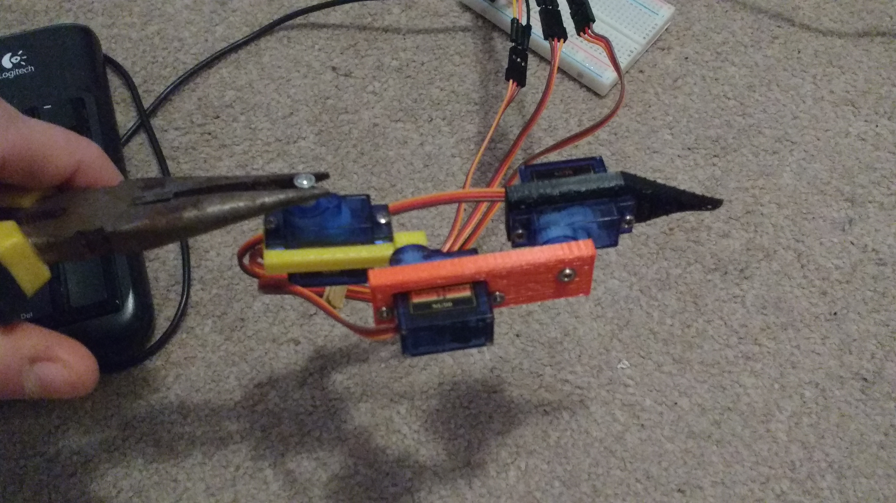

These are the instructions for piecing together the hardware components of the robot.

### Assembling a leg

Each leg has three main parts, each consisting of a servo and a brace to hold it. 

Each leg should have three servos, and each servo has its own signal wire, to receive PWM signals
from the board. To assemble a leg, use the pins 0, 1, 2 on the board, and check the wiringPi pin
configuration for that. The servos work best with 3.3v on the positive pin, and must also have a
ground connection. To be safe, place a 1k ohm resistor in between the GPIO pin of the Rasberry Pi
board and the servo's signal wire, in case of any unwanted surges.

To assemble the legs, don't screw the servos in at first. Run `./bin/test_leg`. That program will make the horizontal servo end at 90 degrees, or half way around, and the vertical-moving servos will each be flat. Once the servos are in their starting positions, screw them tight to their adjoining braces in this configuration:

Now they're screwed in, you can run `.test/leg` again for this servo and you will see it do a full
walk rotation, and then return to its flat position. Once configured and tested, this leg can be
attached to the base of the robot, in this configuration:

When all legs are tested and assembled, they can be screwed into the board, like the leg above, and their pins attached to the Raspberry Pi GPIO pins. The pins each leg will use are defined in the robot class, however, those should be:

    leg_0:
        bottom_servo: 0
        middle_servo: 1
        top_servo: 2
    leg_1:
        bottom_servo: 3
        middle_servo: 4
        top_servo: 5
    leg_2:
        bottom_servo: 6
        middle_servo: 7
        top_servo: 8
    leg_3:
        bottom_servo: 9
        middle_servo: 10
        top_servo: 11

The first, leg_0, will be the top right leg on the forward-facing robot, and the legs will continue around in a clockwise fashion. There's numbers indicating which is which. It it important that the legs are in the right order, because opposing legs (leg_0, leg_2) and (leg_1 , leg_3) will move at the same time, the same as a spider moves its opposing pairs of legs together.
